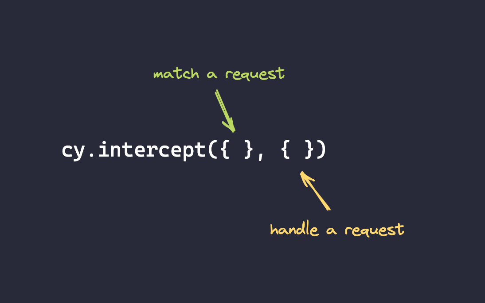

# intercepting network requests

Cypress is great for creating a combination of UI and API tests. You can take a look into how your application is behaving and what kind of data it is sending to the server

## .intercept()
- similar syntax to `.request()` but in this case we are **not** sending requests but are **observing** requests that our application does.
```js
cy.intercept({
    method: 'POST',
    url: '/api/cards'
  }).as('createCard')
```

## stabilizing tests
- intercept can help stabilize a test
- by waiting for a certain request to occur, we can wait for a response and proceed our test then

## matching a request
- by string, regex or minimatch

## mocking a response
- intercept allows us to change the response or any other attributes of a request
- we can mock our server, or change request attributes to test different edge cases of our app

## `.intercept()` command takes two objects

- we can define `body` and provide a response to our test
- we can provide a static fixture from a file using `fixture` attribute:
```js
cy.intercept({
    method: 'GET', 
    url: '/api/boards'
  }, {
    fixture: 'twoBoards'
  })
```

## testing error messages
- defining `status` or `forceNetworkError` attributes to the handler object:
```js
cy.intercept('POST', '/api/boards', {
    forceNetworkError: true
  })
```
or change status code:
```js
cy.intercept('GET', '/api/boards', {
    statusCode: 403
  })
```

## Useful reading
* [docs for .intercept() command](https://docs.cypress.io/api/commands/intercept.html)
* [docs for .as() command](https://docs.cypress.io/api/commands/as.html)
* [docs for .wait() command](https://docs.cypress.io/api/commands/wait.html)
* [docs for .its() command](https://docs.cypress.io/api/commands/its.html)
* [tool for testing minimatch](https://pthrasher.github.io/minimatch-test/)
* [tool for testing regular expressions](https://regexr.com/)
* [docs about stubbing responses](https://docs.cypress.io/api/commands/intercept.html#Stubbing-a-response)
* [using fixtures with stubbed responses](https://docs.cypress.io/guides/)